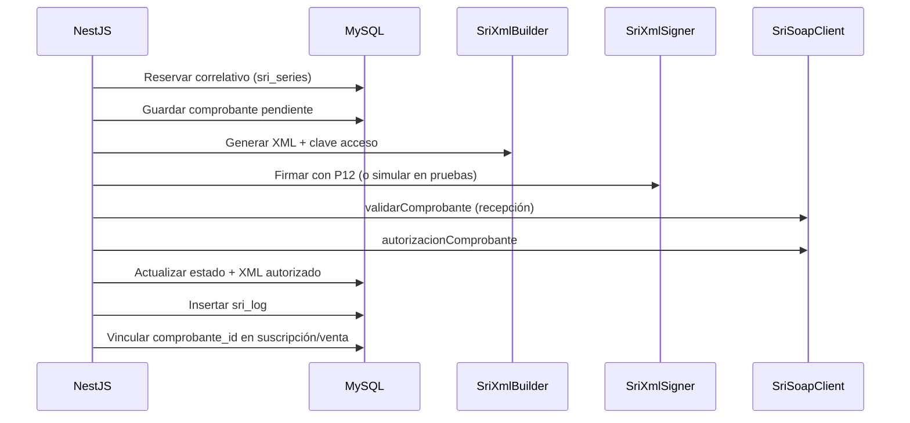

# Fase 09 — Facturación electrónica SRI (Ecuador)

**Estado:** Aprobada (2026-07-02) — lista para Fase 10 Flutter

## Objetivo de la fase

Migrar facturación electrónica SRI desde PHP (`FacturacionElectronicaController`, `FacturadorSri`) a NestJS sin romper el flujo fiscal: XML, firma, recepción, autorización, logs y vínculo con ventas/membresías.

## Archivos PHP analizados

| Archivo | Función |
|---------|---------|
| `FacturacionElectronicaController.php` | Bandeja, emitir suscripción/venta, NC, XML, reintento, logs |
| `FacturadorSri.php` | Orquestación: IVA, secuencial, XML, firma P12, SOAP SRI |
| `XmlBuilderSri.php` | XML factura (01) y nota crédito (04), clave acceso 49 dígitos |
| `XmlSignerSri.php` | Firma digital PKCS#12 |
| `SriClient.php` | SOAP recepción/autorización (celcer/cel) + simulador pruebas |
| `ComprobanteElectronico.php` | Persistencia cabecera/detalle, correlativos, logs |
| `ConfiguracionController::sri` | Config fiscal y certificado |

## Tablas involucradas

| Tabla | Uso |
|-------|-----|
| `comprobantes_electronicos` | Cabecera fiscal |
| `comprobantes_detalle` | Líneas con IVA |
| `sri_series` | Correlativos por tipo/serie |
| `sri_log` | Auditoría SOAP |
| `configuracion` | RUC, ambiente, establecimiento, certificado |
| `suscripciones` / `ventas` | `comprobante_id`, `tipo_comprobante` |

## Reglas de negocio detectadas (PHP)

| Regla | Detalle |
|-------|---------|
| Tipos soportados | `01` Factura, `04` Nota de crédito |
| IVA Ecuador | Tasa configurable (`iva_tasa`, default 15%), precios con/sin IVA |
| Secuencial | Transaccional `FOR UPDATE` en `sri_series` |
| Clave acceso | 49 dígitos con módulo 11 |
| Ambiente | `1` pruebas (celcer), `2` producción (cel) |
| Certificado | P12 en `public/cert/`; clave en BD (nunca exponer en API) |
| Pruebas sin P12 | Firma y SRI simulados (paridad PHP ambiente 1) |
| Consumidor final | `9999999999999` si sin identificación |
| Entrenador | Sin acceso a facturación |
| Estados SRI | pendiente → recibida/devuelta → autorizado/no_autorizado/error |

## Flujo de emisión (NestJS)



## Módulos NestJS

### Slice 1 — Consulta
- `billing-sri/` — bandeja, detalle, logs, descarga XML, config fiscal

### Slice 2 — Emisión
- `sri-billing.service.ts` — orquestación (port `FacturadorSri.php`)
- `services/sri-tax-calculator.service.ts` — IVA 15%
- `services/sri-xml-builder.service.ts` — XML factura (01) y NC (04)
- `services/sri-xml-signer.service.ts` — firma P12 (`node-forge` + `xml-crypto`)
- `services/sri-soap-client.service.ts` — SOAP SRI + simulador offline
- `services/sri-receipt-repository.service.ts` — correlativos y persistencia
- `utils/sri-access-key.util.ts`, `sri-environment.util.ts`, `sri-xml.util.ts`

### Slice 3 — RIDE PDF y email
- `services/sri-ride-export.service.ts` — RIDE PDF con QR (clave de acceso SRI Ecuador)
- `services/sri-mail.service.ts` — envío real SMTP (PDF + XML adjuntos)
- `GET /electronic-receipts/:id/pdf`
- `POST /electronic-receipts/:id/send-email`
- Readiness producción en `GET /sri-config` (`productionReady`, `readinessChecks`, endpoints celcer/cel)

## Endpoints

| Método | Ruta | Rol | Descripción |
|--------|------|-----|-------------|
| GET | `/electronic-receipts` | admin, recepcionista | Bandeja con filtros |
| GET | `/electronic-receipts/:id` | admin, recepcionista | Detalle + líneas |
| GET | `/electronic-receipts/:id/logs` | admin, recepcionista | Logs SRI |
| GET | `/electronic-receipts/:id/xml` | admin, recepcionista | Descarga XML |
| GET | `/sri-config` | admin | Config fiscal sin secretos |
| POST | `/electronic-receipts/issue/membership/:membershipId` | admin, recepcionista | Emitir factura desde suscripción |
| POST | `/electronic-receipts/issue/sale/:saleId` | admin, recepcionista | Emitir factura desde venta POS |
| POST | `/electronic-receipts/:id/credit-note` | admin, recepcionista | Nota de crédito sobre factura autorizada |
| POST | `/electronic-receipts/:id/retry` | admin, recepcionista | Reintentar autorización SRI |
| GET | `/electronic-receipts/:id/pdf` | admin, recepcionista | RIDE PDF con QR |
| POST | `/electronic-receipts/:id/send-email` | admin, recepcionista | Enviar RIDE + XML por correo |

## Variables de entorno

```env
SRI_CERT_DIR=cert
SRI_XML_DIR=sri/xml
SMTP_HOST=
SMTP_PORT=587
SMTP_SECURE=false
SMTP_USER=
SMTP_PASS=
SMTP_FROM=
```

Certificado y clave se leen de `configuracion` en BD (`sri_certificado_p12`, `sri_certificado_clave`).

## Decisiones técnicas (slice 2)

| Tema | Decisión |
|------|----------|
| Enum ambiente Prisma | `pruebas`/`produccion` → normalizado a `1`/`2` vía `sri-environment.util.ts` |
| SOAPAction SRI | Header vacío `""` (JAX-WS offline); fault SOAP activa simulación |
| Sin P12 en pruebas | `forceSimulate` en recepción/autorización (paridad PHP) |
| Dependencias | `xml-crypto`, `@xmldom/xmldom`, `node-forge` |

## Pendientes operativos (producción real)

- Cargar certificado P12 válido en `public/cert/` y clave en `configuracion`
- Cambiar ambiente a producción (`2`) y emitir comprobante de prueba en **cel.sri.gob.ec**
- Configurar SMTP para envío automático a clientes

## Cambios de base de datos

Ninguno (tablas legacy existentes).

## Pruebas realizadas

- `npm run build` → OK
- `npm run audit:phase-09` → **17/17 OK** (consulta + emisión + RIDE PDF + email)

## Cómo hacer rollback

Eliminar módulo `billing-sri/` y revertir `app.module.ts`.

## Estado final de la fase

Fase 09 completa en backend: consulta, emisión, RIDE PDF, email SMTP y checklist de readiness producción. **Aprobada por el usuario** el 2026-07-02. Próximo paso: **Fase 10 — Flutter**.
